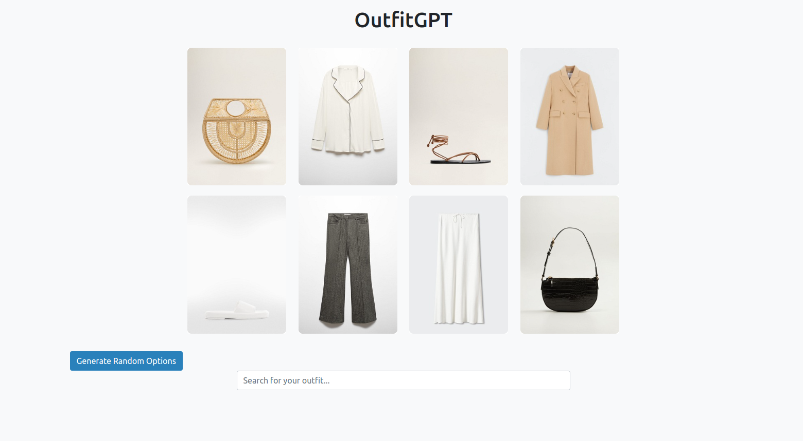
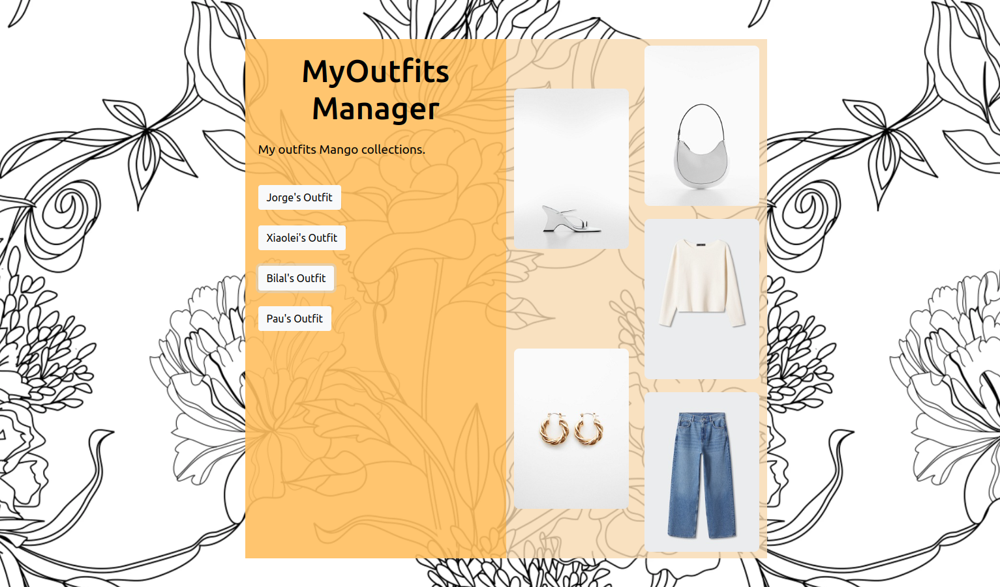
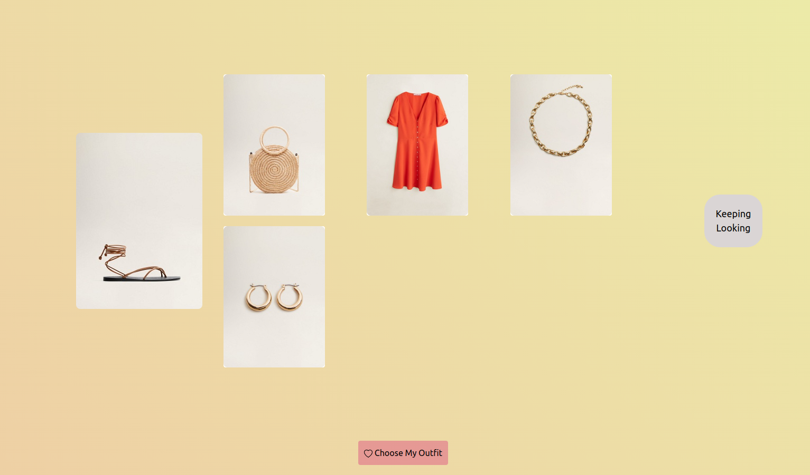
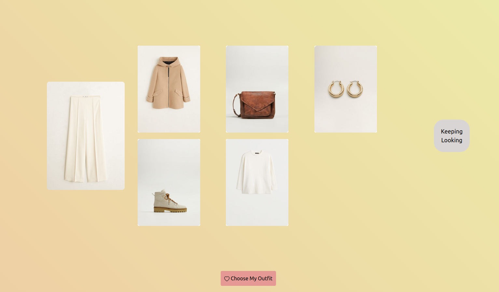

# OutfitGPT
## UPC Datathon 2023 Mango-Challenge

Xiaolei Xu, 
Bilal Moussaouri, 
Jorge Gil,
Pau Morente

## Overview

Photo: Main Page
# OutfitGPT User Interface Overview

## Main Page

The Main Page of OutfitGPT serves as the entry point for users to input their preferences and generate outfits. The following elements are featured on the Main Page:

### Input Preferences

Generated patterns are created using the following main parameters:

- **Colors:** Select preferred colors for different clothing items.
- **Family Members:** Choose the family members of clothing items (e.g., tops, bottoms, shoes).
- **Style Preferences:** Indicate the desired style, such as casual, formal, sporty, etc.

### Random Values and Seed

For added spontaneity and creativity, users have random values in the outfit main page to use as seed. They can also specify a seed using the search bar (not implemented, will use same function).

### Generate Outfit Button

When the seed is clicked, creates an outfit for that piece of clothing. 

## Outfit Manager

The Outfit Manager is a centralized space where users can organize, save, and visualize their selected outfits. Key features of the Outfit Manager include:

### Outfit Storage

- **Save Outfits:** Users can save generated outfits that they find appealing. Each saved outfit is stored with relevant details, including colors, family members, and style.

### Visualization

- **Quick Preview:** Users can get a quick visual preview of their saved outfits directly within the Outfit Manager, facilitating efficient selection.

### Sorting and Filtering (Not Implemented)

- **Sort and Filter:** Efficiently organize outfits based on various criteria, such as occasion, season, or style. This feature streamlines the process of finding the perfect outfit.

## Generated Outfit Page

Once an outfit is generated, users are directed to a page featuring the details of the outfit. This page includes:
Example 1:

Example 2:

### Outfit Details

- **Colors, Family Members, and Style:** Detailed information about the colors, family members, and style of each clothing item in the generated outfit.

### Choose Outfit Button (Half Implemented)

- **Keep or Discard:** Users have the option to choose the generated outfit and save it in their Outfit Manager. Choosing the outfit saves it to the Outfit Manager for future reference.

The combination of the Main Page, Outfit Manager (focused on visualization), and Generated Outfit Page provides a comprehensive and user-friendly experience for outfit creation, organization, and selection within the OutfitGPT application.

# MANGO CHALLENGE INITIAL STATEMENT

## Fashion Compatibility Challenge 

This challenge aims to create a model capable of generating outfit recommendations based on a given initial product. Fashion matching is complex due to the nuanced patterns and visual details that dictate whether products pair well together, often going beyond mere product metadata. For instance, it's not straightforward to determine if a violet satin dress, white sandals, and a silver chic bag make a good outfit without seeing the items.
 
The essence of a good outfit often lies in the complementary nature of different products rather than their similarity. The task here is to extract and model these visual features to predict matching products effectively. One approach to address this is the "Fill in the Blank" task, where the goal is to predict a missing item in a given outfit from a list of candidate products. This task serves as a stepping stone towards generating complete outfits from a single product. However, participants are encouraged to explore other innovative solutions to this challenge as well.
 
Participants will have the opportunity to work with real outfits curated by stylists and fashion experts at MANGO and exhibit their proficiency in navigating a software development environment while adhering to strict deadlines and maintaining performance under a high-pressure scenario.

## Brief Data Overview
Participants will access two datasets and images.

1. **Product Data (`product_data.csv`)**: This dataset includes comprehensive attributes of fashion items such as identifiers, colors, materials, product types, and the file path to the associated image.
2. **Outfit Data (`outfit_data.csv`)**: Contains links between fashion items and outfits, identifying which items are paired together.
Both datasets provide a wealth of features to analyze fashion item characteristics and their combinations in outfits. Refer to the [Dataset description](datathon/dataset/dataset_description.md) for detailed information on dataset fields, dataset relationships and how to download the data.

## Objectives
* Develop a model to effectively predict matching products based on tabular/visual features.
* Exhibit creativity in approaching the fashion compatibility challenge.
* Demonstrate the applicability and scalability of the proposed solution through a proof-of-concept.
 
## Evaluation
While the evaluation will not follow a specific performance metric, evaluation will be based on:

1. A 10-minute elevator pitch, showcasing their proof-of-concept to a panel of experts with diverse experience in data science, machine learning, and fashion. Teams are expected to present at least 5 newly created outfits based on the given products in the dataset. The evaluation will focus on the creativity, complexity, applicability of the proposed solution and the team's communication abilities.
2. The team's Github repository - showcasing:
   - Code quality
   - Documentation 
   - Use of Version Control & Branching strategies
 
## Considerations
* Enough time should be allocated for the final presentation as effective communication is crucial for this challenge. Preparing a demo or utilizing a UI like [Streamlit](https://streamlit.io/) can significantly aid in demonstrating your proof-of-concept.
* Participants are free to enrich the dataset with external resources; however, pay attention to the licenses of data and/or models you utilize.

## Get started
1. Fork this [Github Datathon Challenge](https://github.com/data-science-mango/datathon-2023-fashion-compatibility) repository
2. Download the data as a `.zip` file from the following [link](https://mng-datathon-upc.s3.eu-west-1.amazonaws.com/datathon.zip) and unzip it in the forked repository
3. Read the [Dataset description](datathon/dataset/dataset_description.md)

## Who we are
With a rich legacy rooted in Barcelona, MANGO captivates the global fashion scene through its innovative blend of design and technology, offering a seamless fusion of online and in-store shopping experiences across over 115 markets, embodying the essence of taking fashion further.

## Organizing Committee
- Andrea Coloma
- Cristina Ruiz-Larrea
- Adrian Martinez Lopez
- Judith Beltran Lopez
- Sandra Millet Salvador
- Lucas Anton Pastur
- Matthias Brenninkmeijer

Best of luck, and happy coding!
